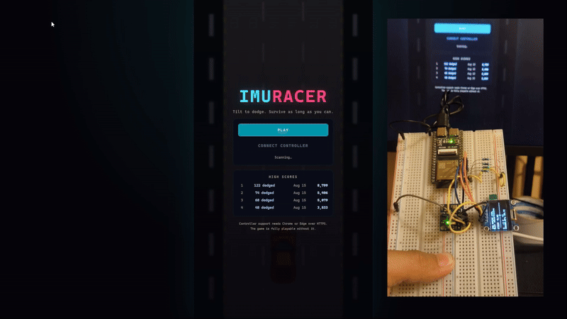

# IMU Racer

**A browser racing game steered by tilting a real circuit board.**

An ESP32-S3 reads a GY-87 inertial module, turns the board's roll angle into a
steering value, and streams it over Bluetooth Low Energy. A three.js game in the
browser picks it up through the Web Bluetooth API — no driver, no app, no
install. Tilt the board, the car moves.



**▶ Play it: https://saufik.web.id/imu-racer/** — no hardware needed, the
keyboard and touch controls work on their own.

*[Read this in Indonesian → `README.id.md`](README.id.md)*

---

## Contents

- [What it does](#what-it-does)
- [Repository layout](#repository-layout)
- [Hardware](#hardware)
- [Firmware](#firmware)
- [The game](#the-game)
- [BLE protocol](#ble-protocol)
- [Deploying to a website](#deploying-to-a-website)
- [Design notes](#design-notes)
- [Troubleshooting](#troubleshooting)
- [Credits and licensing](#credits-and-licensing)

---

## What it does

Dodge oncoming traffic on a three-lane road. The road speeds up as you survive,
traffic gets denser, and the run ends the first time you hit something. Score
comes from distance covered — weighted by speed, so surviving fast is worth more
than surviving slow — plus a bonus per car dodged. The top eight runs are kept.

Three ways to steer, all live at once:

| Input | How |
| --- | --- |
| **The board** | Tilt left and right. Level is captured a second after reset. |
| Keyboard | `←` `→` or `A` `D`; `Space` / `Enter` to start |
| Touch or mouse | Drag anywhere on the play area |

The fallbacks are not a courtesy. Web Bluetooth does not exist in Firefox or on
any iOS browser, so a public page needs to work without it.

## Repository layout

```
firmware/   ESP-IDF v6.0.2 project — sensors, OLED, BLE peripheral
web/        Vite + three.js game — rendering, Web Bluetooth client
assets/     Original artwork (car sheet, road texture, explosion strip)
docs/       Protocol, hardware and troubleshooting detail
```

## Hardware

| Part | Notes |
| --- | --- |
| ESP32-S3 dev board | Any variant; BLE 5 is built in |
| GY-87 | MPU6050 + magnetometer + BMP180 on one board |
| SSD1306 OLED | 128×64, I²C |

Two separate I²C buses, so a slow display refresh never delays a sensor read:

| Bus | Signal | GPIO |
| --- | --- | --- |
| Sensors | SDA | 5 |
| Sensors | SCL | 4 |
| Display | SDA | 7 |
| Display | SCL | 6 |

Both devices run at 3.3 V. Internal pull-ups are enabled but weak — if a bus
scan comes up empty, add 4.7 kΩ resistors to 3V3 on SDA and SCL.

Pins live at the top of [`firmware/main/i2c_bus.h`](firmware/main/i2c_bus.h).

### What is actually on a GY-87

The magnetometer and barometer sit behind the MPU6050's *auxiliary* I²C bus.
They stay invisible until the firmware clears `USER_CTRL` **and** sets
`I2C_BYPASS_EN` in `INT_PIN_CFG`. Doing only the second — a common mistake — is
enough to keep them hidden.

Board variants differ, so the driver probes rather than assumes:

| Chip | Address | Notes |
| --- | --- | --- |
| MPU6050 | `0x68` | accelerometer + gyroscope |
| HMC5883L | `0x1E` | magnetometer, original part |
| QMC5883L | `0x0D` | magnetometer, clone; different byte order |
| BMP180 | `0x77` | barometer; a `0x58` chip ID means a BMP280 instead |

Missing chips are not fatal. A board with no magnetometer still reports
acceleration, and steering only needs the accelerometer anyway.

## Firmware

Built and tested against **ESP-IDF v6.0.2**, target **esp32s3**.

```bash
cd firmware
idf.py set-target esp32s3
idf.py -p COM11 flash monitor
```

### Structure

| File | Role |
| --- | --- |
| [`main.c`](firmware/main/main.c) | control loop, tilt maths |
| [`i2c_bus.c`](firmware/main/i2c_bus.c) | bus setup, address scanner, register helpers |
| [`gy87.c`](firmware/main/gy87.c) | MPU6050, HMC5883L/QMC5883L, BMP180 |
| [`ssd1306.c`](firmware/main/ssd1306.c) | display driver, framebuffer, 5×7 font |
| [`ble_controller.c`](firmware/main/ble_controller.c) | NimBLE peripheral |

### Loop timing

Two rates in one task:

- **50 Hz** — read the accelerometer, filter, publish over BLE
- **~240 ms** — barometer, magnetometer, OLED redraw, serial log, BLE upkeep

The split matters. A BMP180 pressure conversion blocks for about 35 ms, so
putting it in the fast path would wreck the control cadence. Steering at 4 Hz is
unplayable; a barometer read at 4 Hz is plenty.

### Tilt to steering

Standard accelerometer tilt, using the magnitude of the other two axes in the
denominator so both angles stay well behaved as the board approaches vertical:

```c
roll  = atan2f(ax, sqrtf(ay*ay + az*az)) * 57.29578f;
pitch = atan2f(ay, sqrtf(ax*ax + az*az)) * 57.29578f;
```

A low-pass filter (`TILT_ALPHA`) removes hand tremor. Level is captured about a
second after reset, once the filter has settled, so a board still being put down
does not become the reference. `STEER_RANGE_DEG` sets how far you must tilt for
full lock — lower it for a twitchier wheel.

The deadzone is rescaled rather than clipped, so there is no step at its edge.

### On-board display

The OLED shows BLE state, the steering value, a live steering bar, tilt angles
and barometer reading. That means you can confirm the controller works before
opening a browser at all — a genuinely useful thing when debugging a wireless
link.

## The game

```bash
cd web
npm install
npm run dev      # http://localhost:5180
npm run build    # self-contained dist/
```

### Assets

All three assets are processed at load time rather than pre-baked:

- **Car sheet** — one SVG holding four cars. It is rasterised, then split on
  fully transparent columns and cropped to each car's tight bounding box. More
  robust than assuming an even grid, since the cars are not evenly spaced. Falls
  back to an even four-way split if the sheet ever changes shape.
- **Road texture** — supplied horizontally (lane dashes left-to-right, yellow
  lines along the top and bottom). Rotated 90° once into a canvas at load,
  rather than fighting UV rotation every frame.
- **Explosion** — a 96×32 strip cut into three 32×32 frames.

The player drives the red car; traffic is green, yellow and blue.

### Rendering

An orthographic top-down camera with a fixed 16-unit vertical view. The play
area is a 9:16 portrait panel so lane geometry reads identically on a phone and
on a widescreen monitor. A `ResizeObserver` drives the canvas size — a `window`
resize listener misses the case where the element is still zero-sized when the
game is constructed, and then never fires to correct it.

## BLE protocol

Full detail in [`docs/PROTOCOL.md`](docs/PROTOCOL.md). In short:

| Role | UUID |
| --- | --- |
| Service | `4f1a0000-8b2c-4f5e-9d3a-1c7e6b9f0a01` |
| Telemetry (notify) | `4f1a0001-8b2c-4f5e-9d3a-1c7e6b9f0a01` |
| Command (write) | `4f1a0002-8b2c-4f5e-9d3a-1c7e6b9f0a01` |

8 bytes, little-endian, at 50 Hz: `int16 steer`, `int16 pitch`, `uint8 buttons`,
`uint8 flags`, `uint16 seq`. Writing `0x01` to the command characteristic
recaptures the level reference.

## Deploying to a website

`npm run build` produces a self-contained `dist/`. `base: './'` is set, so it
works from any sub-folder.

Three things that will catch you out:

**Serve over HTTPS.** Web Bluetooth only exists in a secure context. On plain
http `navigator.bluetooth` is undefined, the connect button disables itself and
explains why, and the game still plays on keyboard and touch. `localhost`
counts as secure, which is why the dev server works.

**Link with a trailing slash** — `/games/imu-racer/`, not `/games/imu-racer`.
Relative asset URLs resolve against the directory.

**Embedding needs explicit permission.** In an iframe the parent must grant it,
or connecting fails with a policy error:

```html
<iframe src="/games/imu-racer/" allow="bluetooth" width="405" height="720"></iframe>
```

### The live copy

The deployed game is a copy of `web/dist/` sitting in the `imu-racer/` folder of
the [`personal-web`](https://github.com/saufik-ramadhan/personal-web)
repository, which GitHub Pages serves at the custom domain. To refresh it after
a change:

```bash
cd web && npm run build
# then replace personal-web/imu-racer/ with the contents of web/dist/
```

It is a copy, not a submodule, so it does not update itself — rebuild and copy
again or the deployed version quietly goes stale.

### Browser support

Chrome, Edge and Opera on desktop and Android. Not Firefox, not Safari, not any
iOS browser. Those visitors get touch controls.

## Design notes

### The traffic bug worth knowing about

The first version gave every car its own speed, which looked more natural. It
was not: a slow car from one wave drifts alongside a fast car from the next, and
they can block all three lanes at once. Measured over two simulated minutes,
**9.5% of frames had no free lane** — runs that were lost through no fault of
the player.

Traffic now shares one closing speed, so the vertical gap between waves is
preserved exactly. A wave also refuses to spawn within `MIN_WAVE_GAP` of the
previous one, and the free lane only ever shifts by one, so consecutive waves
are always reachable. Re-measured: zero frames with all three lanes blocked,
always at least one lane free.

The lesson generalises. "Looks more varied" and "is still fair" are separate
properties, and only one of them shows up in a screenshot.

### Difficulty

Speed ramps from 1.0× to a 3.6× cap over roughly 90 seconds. Spawn interval
scales inversely with speed, and two-car waves go from rare to common as the run
goes on. A greedy bot that always steers for the emptiest lane survives 23–36
seconds and dodges 23–47 cars, which leaves clear headroom for a human with
lookahead.

## Troubleshooting

Longer version in [`docs/TROUBLESHOOTING.md`](docs/TROUBLESHOOTING.md).

**Do not pair the controller from the OS Bluetooth panel.** Web Bluetooth does
not use OS pairing — the browser opens its own GATT connection. Windows will
connect, find no profile it recognises, and hang up. Worse, a BLE peripheral
stops advertising while connected, so the browser's chooser goes empty while the
OS holds the link. Leave Bluetooth switched on and connect from the page.

**Nothing on a bus.** The boot scan prints every address that answers. An empty
bus is wiring or pull-ups.

**Disconnect reasons are decoded in the log:**

```
I (12345) ble_ctrl: disconnected, reason 0x213 -- remote terminated the connection
```

`0x208` is a supervision timeout, `0x213` means the central hung up, `0x206`
means a stale pairing key is cached somewhere.

## Credits and licensing

The firmware began as the ESP-IDF `blink` example (Apache-2.0) and has been
rewritten; the LED code is gone entirely.

All artwork comes from [OpenGameArt.org](https://opengameart.org):

| Asset | Title | Author | Licence |
| --- | --- | --- | --- |
| Cars | [Car — Racer](https://opengameart.org/content/car-racer) | Bahi | CC-BY 3.0 |
| Road | [Toon Road Texture](https://opengameart.org/content/toon-road-texture) | [da_st](https://www.davidstenfors.com) | CC-BY 3.0 |
| Explosion | [Simple Explosion](https://opengameart.org/content/simple-explosion) | NiceGraphic | CC0 |

Two of the three are **CC-BY 3.0**, so attribution has to travel with the work
wherever it is redistributed — the built game included, not just this
repository. That is why the credits also appear on the game's title screen. Full
detail, including what was changed in each asset, is in
[`docs/CREDITS.md`](docs/CREDITS.md).

Project code is MIT licensed — see [`LICENSE`](LICENSE). The artwork is not
covered by it; it stays under the licences above.
